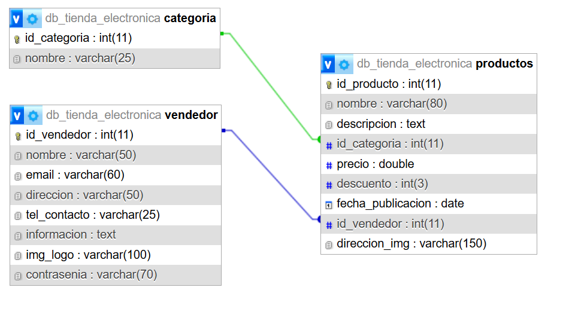

## Tienda electrónica

# Integrantes
Klaus del Valle (kldelvalle3@gmail.com)

# Temática
Tienda online de diferentes productos electrónicos

# Descripción
Este sitio web permite a los usuarios ver productos electrónicos en venta y también permite a las empresas o a los negocios publicar sus propios productos.

# Diagrama de entidad relación (DER)

# Requisitos

PHP 7.4 o superior
MySQL 5.7 o superior
Servidor web (Apache/Nginx) con mod_rewrite habilitado
phpMyAdmin (opcional, para gestión de BD)

# Instalación

Clona o descarga el proyecto en tu servidor web (ej: htdocs en XAMPP).
Configura la base de datos como se indica abajo.

# Configuración de la Base de Datos

Abre phpMyAdmin en tu navegador (generalmente http://localhost/phpmyadmin).
Crea una nueva base de datos llamada db_tienda_electronica (collation: utf8_general_ci).
Selecciona la base de datos creada.
Ve a la pestaña "Importar".
Click en "subir archivo" para importar el script  db/db_tienda_electronica.sql

# Estructura del Proyecto

router.php: Punto de entrada y enrutamiento.
config.php: Configuración de la base de datos.
app/controllers/: Controladores.
app/models/: Modelos.
app/views/: Vistas.
app/middlewares/: Middlewares.
assets/: Archivos estáticos (CSS, JS).

# Usuarios de prueba

Usuario 1:

email: webadmin@gmail.com
contraseña: admin

Usuario 2:

email: admin@gmail.com
contraseña: admin

Usuario 3:

email: admin2@gmail.com
contraseña:admin